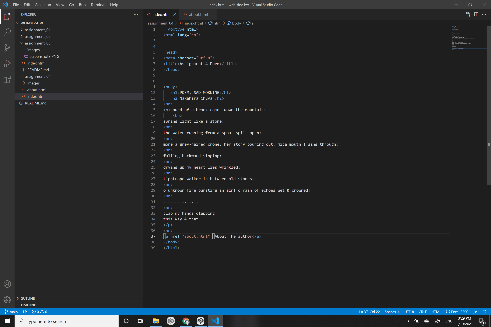

1:Where I have decided to go back to is Msn on July 4th of 2009. Ah what memories this brought back. The simplicity of msn's setup the normal looking links and gradient background. Things were so much easier to find on msn back then in my opinion. Msn has changed quite a bit. they now are using a bunch of scripts and their setup is more like a magazine. It is a bit difficult to navigate and there are tons of ads. 

2:Github desktop honestly makes life so much easier. I enjoy using it to speed up my uploading process. Github in itself seems to be a very well developed tool where people that do not know much about web development can play around. I bet professionals use it also. I personally enjoy using it for my coding adventures.

3:
